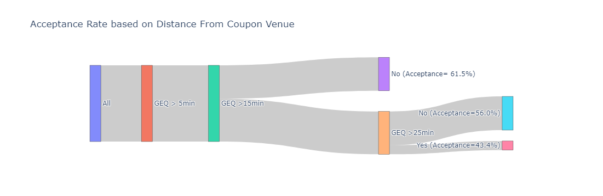
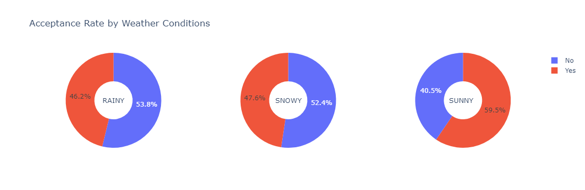
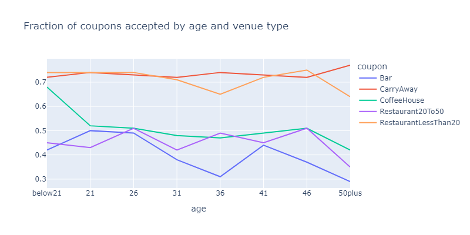
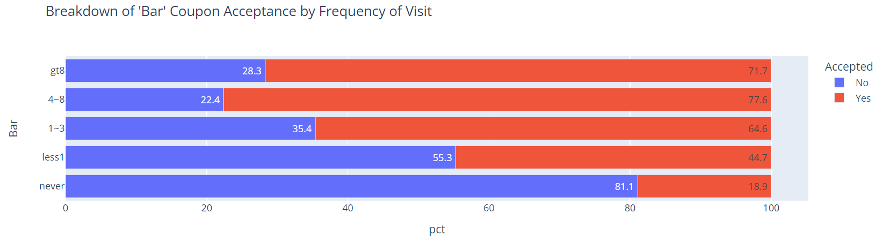
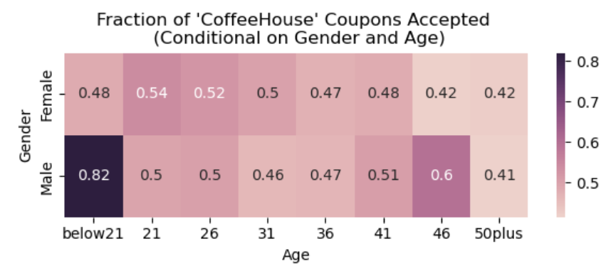

# Assignment 5.1: Will a Customer Accept the Coupon?
 
## Overview
In this project, we look at Amazon Mechanical Turk survey data that comes to us via the UCI Machine Learning repository. A coupon is delivered to the cell phones of drivers when they are in the vicinity of a restaurant, and the data records their response: if they accepted to use it right away, save it for a later date or declined the coupon. Additionally, we have access to a variety of other information such as personal and demographic information of the driver, type of coupon, weather, destination, and so on. Our goal here was to use our current knowledge of plotting and visualizations to highlight differences between who did or did not accept a coupon offering.

## Analysis
### Investigating and Cleaning Data
The first step was to load the data, and investigate it for any missing/problematic values. There were a few mistakes in spellings which we have ignored at this stage. But the main steps in this direction were:

1. _'Car'_ column is missing 99% of the values - we are going to ignore this in any analysis due to sparsity of information.
2. _'Bar'_, _'CarryAway'_, etc. columns, which record the frequency of visit, are missing 1-2% of the values. We decided to drop these rows from our analysis.
3. Edit the _'coupon'_ columns to make sure the spellings match with the column names that record frequency of visit. For example, 'Restaurant(<20)' becomes 'RestaurantLessThan20'. This is in order to make the charts and data easier to interpret.
4. Customers with no specific driving destination have been marked as driving in opposite direction to the coupon venue. We believe this is incorrect and will skew the results. Hence we added a new _'Direction'_ column with 3 possible values: Same, Opposite and NA.

### Results
Based on the prompts provided in the starter notebook, we looked at the different factors that might affect the chances of a coupon being accepted. The first few things that we looked at were the driving direction, distance to coupon venue, age of customer, and the weather. 

**Longer distance to coupon venue decreases chances of acceptance**

**Customers more likely to accept coupons when the weather is good**

**Age impacts the rate of acceptance of coupon**
Here the results are not as straightforward. While the total rate of acceptance shows a downward trend as age increases, we can see that the acceptance rate for certain types of coupons such as CarryAway and RestaurantLessThan20 actually stays the same with age, with the former having a jump in acceptance rate for 50+ customers.

**Acceptance rate increases if a customer visits that type of restaurant frequently**
If a customer never visits a bar, his chance of accepting a bar coupon is just 18%. However, if the customer goes to the bar more than 8 times on average, the acceptance rate increases to 72%. 

But this relationship is not the same across different types of coupons. 

### Complex Relationships Between Different Variables
By now, we have successfully demonstrated that there are many factors that can be used to differentiate between customers that accept a coupon or not. But acceptance rate has a complex relationship with all of the variables that can influence the decision.

In an earlier chart, we had seen that the acceptance rate for CoffeeHouse coupons decreases with age. When we look at this data, durther segmented by gender, we see that this happens only among male customers. Male customer under the age of 21 are more than 80% likely to accept coupons from a CoffeeHouse, whereas the acceptance rate among female customers of various age groups remains fairly constant at around 50%.

We are sure that if we are to explore these results further, we can find similar trends in coupons of other restaurant types as well.

## Conclusion and Next Steps
Our visualization skillset has helped us identify clear differences in the profiles of customers that have accepted or declined a coupon. But in this paradigm, we cannot visualize the impact of more than 2 factors at the same time. And we have seen that the relationship between acceptance rate and age, income, coupon type, etc is a lot more complex.
As a next step, we should explore univariate and multi-variate models that can take into account the impact of more than 1 fatcor, and possibly even the relationship between them!

## Link to jupyter-notebook
All these steps and results are further eloborated upon in the attached jupyter-notebook: [a relative link](gsc_submission.ipynb)

